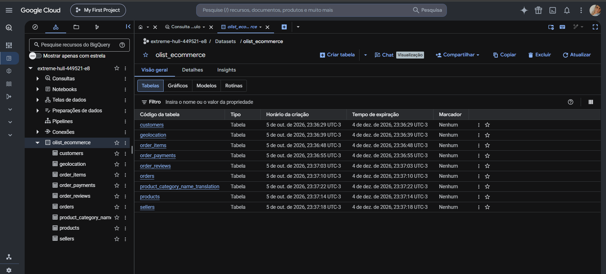
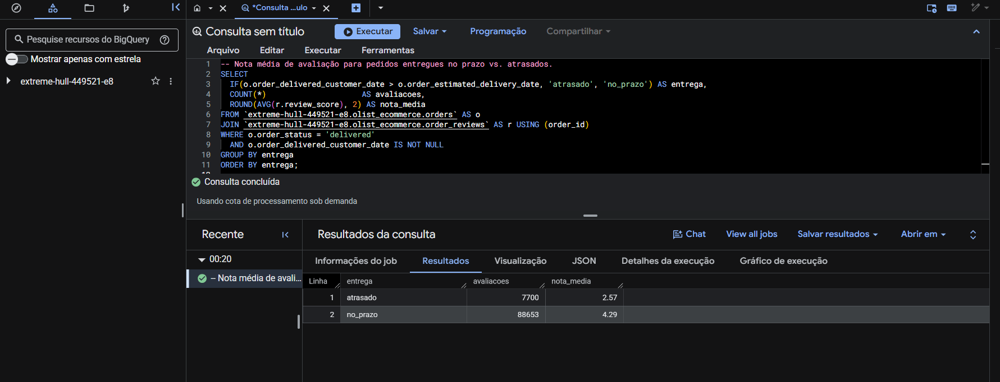

# Pipeline ETL: CSV → BigQuery (Olist Brazilian E-Commerce)

Projeto de portfólio: pipeline ETL que extrai dados de arquivos CSV públicos,
limpa e transforma com Python/Pandas, e carrega o resultado no Google BigQuery.

## Dataset

[Olist Brazilian E-Commerce Public Dataset](https://www.kaggle.com/datasets/olistbr/brazilian-ecommerce)
(Kaggle) — pedidos reais de um marketplace brasileiro entre 2016 e 2018,
dividido em 9 CSVs relacionados (clientes, pedidos, itens, pagamentos,
avaliações, produtos, vendedores, geolocalização).

Por que esse dataset: é real, tem múltiplas tabelas relacionadas (exercita
limpeza e modelagem, não só um CSV solto), e é um case bem conhecido no
mercado de dados — fácil de explicar numa entrevista.

## Arquitetura

```
CSV (Kaggle)  →  Extract (pandas.read_csv)  →  Transform (limpeza)  →  Load (BigQuery)
data/raw/*.csv        src/extract.py            src/transform.py       src/load.py
```

- **Extract**: lê todos os CSVs em `data/raw/` e mapeia cada arquivo para o
  nome da tabela (ex.: `olist_orders_dataset.csv` → `orders`).
- **Transform**: normaliza nomes de colunas, remove espaços em strings,
  converte colunas de data, remove duplicatas exatas.
- **Load**: cria o dataset no BigQuery (se não existir) e carrega cada tabela
  com `WRITE_TRUNCATE` (pipeline idempotente — pode rodar de novo sem duplicar
  dados).

## Pré-requisitos

- Python 3.11+
- Conta Google com acesso ao Google Cloud
- Conta Kaggle (para baixar o dataset)

## Setup

### 1. Ambiente Python

```powershell
cd portfolio-etl-csv-bigquery
python -m venv venv
venv\Scripts\activate
pip install -r requirements.txt
```

### 2. Baixar o dataset

Opção A (recomendada) — via `kagglehub`, já incluso no `requirements.txt`:

```powershell
cd src
python download_data.py
```

Na primeira execução, se você não tiver um `kaggle.json` configurado, o
`kagglehub` abre o navegador para você logar e autorizar o acesso à sua conta
Kaggle. Depois disso, o script copia os CSVs automaticamente para
`data/raw/`.

Opção B — manual: baixe o .zip em
https://www.kaggle.com/datasets/olistbr/brazilian-ecommerce e extraia todos
os CSVs em `data/raw/`.

Opção C — via Kaggle CLI:

```powershell
pip install kaggle
# coloque seu token em %USERPROFILE%\.kaggle\kaggle.json (gerado em kaggle.com/settings)
kaggle datasets download -d olistbr/brazilian-ecommerce -p data/raw --unzip
```

### 3. Configurar o Google Cloud / BigQuery

Como é a primeira vez usando o BigQuery, o caminho mais simples é o
**BigQuery Sandbox**, que não exige cartão de crédito/billing (tem limites de
uso, mas são suficientes para este projeto):

1. Acesse https://console.cloud.google.com/ e crie um projeto novo.
2. No menu, abra o **BigQuery** — ao entrar pela primeira vez sem billing
   configurado, o Google ativa automaticamente o modo *Sandbox*.
3. Habilite a API: **APIs & Services → Enable APIs → BigQuery API**.
4. Crie credenciais para o Python acessar o projeto. Duas opções:
   - **Mais simples (recomendado para começar)**: instale o
     [gcloud CLI](https://cloud.google.com/sdk/docs/install) e rode:
     ```powershell
     gcloud auth application-default login
     gcloud config set project SEU_PROJECT_ID
     ```
   - **Service account** (mais parecido com produção): em
     **IAM & Admin → Service Accounts**, crie uma conta com os papéis
     `BigQuery Data Editor` e `BigQuery Job User`, gere uma chave JSON e baixe
     o arquivo.
5. Copie `.env.example` para `.env` e preencha:
   ```
   GCP_PROJECT_ID=seu-project-id
   BQ_DATASET=olist_ecommerce
   GOOGLE_APPLICATION_CREDENTIALS=caminho\para\sua-chave.json   # deixe vazio se usou application-default login
   ```

## Rodando o pipeline

Testar extração e transformação sem tocar no BigQuery:

```powershell
python src\main.py --dry-run
```

Rodar o pipeline completo (carrega no BigQuery):

```powershell
python src\main.py
```

Conferir no BigQuery (console ou `bq` CLI):

```sql
SELECT COUNT(*) FROM `seu-project-id.olist_ecommerce.orders`;
```

## Resultado no BigQuery

As 9 tabelas carregadas pelo pipeline no dataset `olist_ecommerce`:



## Testes

Testes automatizados (pytest) cobrem a leitura dos CSVs e as regras de limpeza:
nomes de colunas, remoção de espaços, conversão de datas, duplicatas e CSVs com
BOM. Eles rodam sem acesso ao BigQuery e a cada push via GitHub Actions
(`.github/workflows/tests.yml`).

```powershell
pip install -r requirements-dev.txt
pytest
```

## Análises em SQL

Com as tabelas no BigQuery, a pasta [`sql/`](sql/) traz 5 consultas
analíticas. Os resultados abaixo vêm da execução real sobre os dados carregados
pelo pipeline.

| Consulta | Pergunta | Resultado |
|---|---|---|
| [01_receita_mensal](sql/01_receita_mensal.sql) | Quanto o marketplace vendeu por mês? | Crescimento forte ao longo de 2017, com ticket médio estável em torno de R$ 140–150 |
| [02_top_categorias](sql/02_top_categorias.sql) | Quais categorias faturam mais? | `health_beauty` (R$ 1,26 mi), `watches_gifts` (R$ 1,21 mi) e `bed_bath_table` (R$ 1,04 mi) |
| [03_tempo_entrega_por_estado](sql/03_tempo_entrega_por_estado.sql) | Onde a entrega demora mais? | Estados do Norte lideram: RR (29,4 dias), AP (27,2) e AM (26,4) |
| [04_formas_de_pagamento](sql/04_formas_de_pagamento.sql) | Como os clientes pagam? | Cartão de crédito: 78,3% do valor, em média 3,5 parcelas; boleto: 17,9% |
| [05_satisfacao_vs_atraso](sql/05_satisfacao_vs_atraso.sql) | O atraso afeta a avaliação? | Entregas no prazo: nota média 4,29. Atrasadas: 2,57 |

**Insight principal:** pedidos entregues com atraso recebem nota média cerca de
1,7 ponto menor que os entregues no prazo, e a logística para o Norte do país é
o ponto mais crítico.

Exemplo, consulta `05_satisfacao_vs_atraso` executada no BigQuery:



Para rodar uma consulta, abra o arquivo, troque `extreme-hull-449521-e8` pelo
seu `GCP_PROJECT_ID` e execute no console do BigQuery.

## Estrutura do projeto

```
portfolio-etl-csv-bigquery/
├── data/
│   ├── raw/          # CSVs originais (não versionados)
│   └── processed/    # saídas intermediárias opcionais (não versionados)
├── sql/              # consultas analíticas no BigQuery
├── tests/            # testes automatizados (pytest)
├── docs/             # imagens do README
├── src/
│   ├── config.py      # variáveis de ambiente
│   ├── extract.py      # leitura dos CSVs
│   ├── download_data.py # download do dataset via kagglehub
│   ├── transform.py    # limpeza/normalização
│   ├── load.py         # carga no BigQuery
│   └── main.py         # orquestração + CLI
├── requirements.txt
├── .env.example
└── README.md
```

## Habilidades demonstradas

- Extração de dados de múltiplos CSVs com Pandas
- Limpeza e padronização de dados (tipos, datas, duplicatas, strings)
- Modelagem de um pipeline ETL idempotente e parametrizável
- Integração com um data warehouse em nuvem (BigQuery) via API Python
- SQL analítico no BigQuery: JOINs entre várias tabelas, agregações, funções de
  janela e análise de negócio (receita, logística, pagamentos, satisfação)
- Validação dos dados carregados (ex.: identificação de colunas de data
  carregadas como texto e correção na etapa de transformação)
- Testes automatizados (pytest) e integração contínua com GitHub Actions
- Boas práticas de projeto: variáveis de ambiente, `.gitignore`, documentação

## Possíveis melhorias futuras

- Orquestrar com Airflow ou Dagster
- Modelar um star schema (dbt) em vez de carregar as tabelas "como estão"
- Testes de integração do `--dry-run` com uma amostra dos dados
